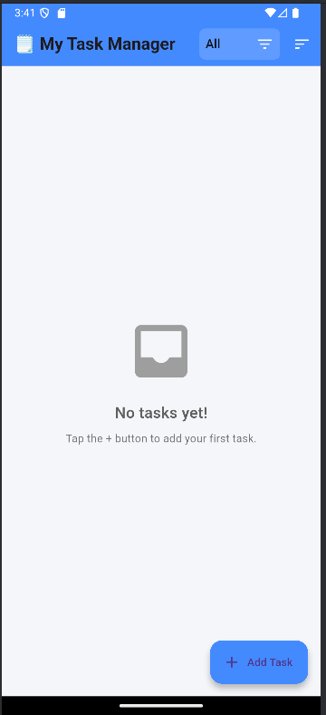
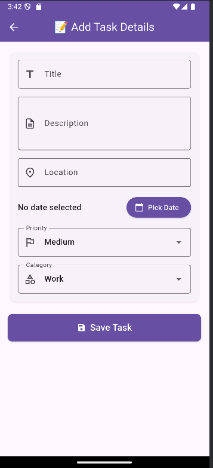

# Flutter Tutorial

Hướng dẫn toàn diện về Flutter - từ cơ bản đến nâng cao

## Mục lục
1. [Giới thiệu Flutter](#1-giới-thiệu-flutter--tổng-quan--lịch-sử-flutter)
   - [Flutter là gì, ai phát triển](#flutter-là-gì-ai-phát-triển)
   - [Ứng dụng thực tế của Flutter](#ứng-dụng-thực-tế-của-flutter)
   - [Ưu điểm, hạn chế, lý do nên học](#ưu-điểm)
2. [So sánh Flutter vs Android Native](#2-so-sánh-flutter-vs-android-native--phân-tích-đối-chiếu)
   - [So sánh ngôn ngữ (Dart vs Java/Kotlin)](#21-so-sánh-ngôn-ngữ-dart-vs-javakotlin)
   - [Cách build UI (Widget vs XML Layout)](#22-cách-build-ui-widget-flutter-vs-xml-layout-android)
   - [Tốc độ phát triển, hiệu năng, tính đa nền tảng](#23-tốc-độ-phát-triển-hiệu-năng-và-tính-đa-nền-tảng)
3. [Cài đặt môi trường & công cụ](#3-cài-đặt-môi-trường--công-cụ--setup-flutter)
   - [Cài đặt Flutter trên macOS](#31-cài-đặt-flutter-trên-macos)
   - [Cài đặt Flutter trên Windows](#32-cài-đặt-flutter-trên-windows)
   - [Cài đặt plugin Flutter vào Android Studio](#33-cài-đặt-plugin-flutter-vào-android-studio)
   - [Tạo project Flutter bằng Android Studio](#34-tạo-project-flutter-bằng-android-studio)
4. [Cú pháp cơ bản trong Dart & Flutter](#4-cú-pháp-cơ-bản-trong-dart--flutter--giới-thiệu-ngôn-ngữ-dart)
5. [Cấu trúc dự án Flutter](#5-cấu-trúc-dự-án-flutter--giải-thích-project-flutter)
6. [Lập trình demo CRUD](#6-lập-trình-demo-crud--ứng-dụng-flutter-cơ-bản)

## Flutter là gì, ai phát triển:
    . Flutter là một framework mã nguồn mở do Google phát triển, được giới thiệu lần đầu vào năm 2017.

    . Dùng để xây dựng ứng dụng đa nền tảng (cross-platform), chỉ cần một codebase duy nhất có thể chạy trên Android, iOS, Web, Desktop và cả thiết bị nhúng.

    . Ngôn ngữ lập trình chính của Flutter là Dart, cũng do Google phát triển.

    . Flutter cung cấp bộ công cụ UI mạnh mẽ, giúp tạo ra giao diện người dùng đẹp, linh hoạt và hiệu năng cao.

## Ứng dụng thực tế của Flutter:
    . Google Ads: ứng dụng quảng cáo chính thức của Google.

    . Alibaba: sử dụng Flutter cho một phần hệ thống thương mại điện tử.

    . BMW, Toyota, eBay Motors, Reflectly: xây dựng các ứng dụng di động cao cấp.

    . Ở Việt Nam, một số startup và công ty phần mềm đã áp dụng Flutter để phát triển ứng dụng đa nền tảng.

## Ưu điểm:
    . Phát triển nhanh chóng: Hỗ trợ tính năng Hot Reload, giúp xem ngay kết quả khi thay đổi code mà không cần build lại toàn bộ ứng dụng.

    . Giao diện đồng nhất: Thay vì dùng XML hay HTML để xây dựng giao diện, Flutter dùng Widget — mọi thành phần trong Flutter (nút, văn bản, hình ảnh, bố cục, v.v.) đều là widget.

    . Nhờ có engine đồ họa riêng (Skia), Flutter vẽ trực tiếp giao diện lên màn hình, không phụ thuộc vào thành phần giao diện của hệ điều hành.

    . Hiệu năng cao: Biên dịch trực tiếp sang mã máy (native code), không cần lớp trung gian như React Native → chạy mượt và ổn định.

    . Cộng đồng lớn, thư viện phong phú: Có hàng nghìn package/plugin sẵn có trên pub.dev.

    . Đa nền tảng thực sự: Một codebase duy nhất cho Android, iOS, Web, và Desktop.

## Hạn chế:
    . Dung lượng ứng dụng lớn hơn so với native do cần gói thêm Flutter engine.

    . Một số API hệ thống chưa được hỗ trợ đầy đủ, đặc biệt trên iOS.

    . Hiệu suất xử lý đồ họa hoặc tác vụ nặng đôi khi kém hơn native.

    . Phụ thuộc vào Google, nếu Google ngừng hỗ trợ, Flutter có thể bị ảnh hưởng.
 
## Lý do nên học Flutter:
    . Phát triển đa nền tảng với một codebase → tiết kiệm thời gian và chi phí.

    . Nhu cầu tuyển dụng cao, đặc biệt ở các startup và công ty phần mềm hiện nay.

    . Dễ học, đặc biệt với người đã quen lập trình hướng đối tượng (Java, C#, JavaScript).

    . Thiết kế giao diện hiện đại, dễ tùy biến, phù hợp cho cả ứng dụng nhỏ và lớn.

## 2. So sánh Flutter vs Android Native – Phân tích, đối chiếu

### 2.1 So sánh ngôn ngữ: Dart vs Java/Kotlin

#### 🟦 Dart (Flutter)
- **Mô hình:** Ngôn ngữ hiện đại, kiểu tĩnh, *null-safety* mặc định, hỗ trợ cả **JIT** (hot reload) và **AOT** (runtime tối ưu khi build release).  
- **Cú pháp:** Gọn, quen thuộc với lập trình hướng đối tượng; dễ tiếp cận với developer từ TypeScript/Java/C#.  
- **Đồng bộ/Async:** `async/await` nhất quán, **Future/Stream** tích hợp tốt với kiến trúc reactive.  
- **Hệ sinh thái:** Pub.dev phong phú; phần lớn thư viện tập trung cho **UI đa nền tảng**.  
- **Tooling:** Hot reload cực nhanh; DevTools hỗ trợ inspect widget tree, performance, memory.  
- **Interop:** Gọi native qua **Platform Channels/FFI**; cần cầu nối khi dùng API nền tảng đặc thù.

#### 🟩 Java/Kotlin (Android Native)
- **Mô hình:** Kotlin là ngôn ngữ ưu tiên hiện tại trên Android (*null-safety*, *coroutines*); Java vẫn phổ biến và ổn định.  
- **Cú pháp:** Kotlin hiện đại, súc tích; Java quen thuộc, hệ sinh thái khổng lồ.  
- **Đồng bộ/Async:** Kotlin **Coroutines** mạnh, linh hoạt; **Flow** cho stream dữ liệu.  
- **Hệ sinh thái:** Mọi API Android đều “native”; kho thư viện Android/Java cực kỳ lớn, đã kiểm chứng.  
- **Tooling:** Android Studio, Profiler, Lint, R8/Proguard, Gradle... – chuỗi công cụ chính quy và sâu sát nền tảng.  
- **Interop:** Trực tiếp truy cập API Android, NDK, Play Services; ít rào cản khi cần tối ưu sâu.


> **Tổng kết:** Dart mạnh về trải nghiệm phát triển và nhất quán đa nền tảng;  
> Kotlin/Java mạnh về tối ưu hoá sâu và tích hợp chặt với hệ sinh thái Android.

---

### 2.2 Cách build UI: Widget (Flutter) vs XML Layout (Android)

#### 🟦 Flutter: Widget tree khai báo (Declarative)
- **Nguyên tắc:** Mọi thứ là *widget*: layout, style, animation, gesture…  
- **Cách hoạt động:** UI là hàm của state → thay đổi state → UI tự rebuild có kiểm soát.  
- **Ưu điểm:**
  - Hot reload gần như tức thì → tốc độ iteration cao.  
  - Giao diện đồng nhất giữa Android/iOS/Web/Desktop (render qua **Skia**).  
  - Custom animation dễ đạt 60/120fps nếu tối ưu tốt.  
- **Lưu ý:**
  - Quản lý state cần kỷ luật (Provider, Riverpod, BLoC...).  
  - Khi cần API native, phải dùng **Platform Channel** hoặc plugin.

#### 🟩 Android Native: XML Layout hoặc Jetpack Compose
- **XML Layout (truyền thống):**
  - Tách UI (XML) và logic (Activity/Fragment/View).  
  - Dễ dùng công cụ như Layout Inspector, Constraint Editor.  
  - Tận dụng View/RecyclerView/Material Components chuẩn Android.  
- **Jetpack Compose (hiện đại):**
  - Mô hình UI khai báo tương tự Flutter, “native-first”.  
  - Tích hợp coroutines/Flow, tương thích toàn bộ hệ sinh thái Jetpack.  
- **Lưu ý:**
  - XML + Fragment phức tạp, nhiều boilerplate.  
  - Compose khắc phục nhiều nhược điểm nhưng chỉ hỗ trợ Android (Compose Multiplatform vẫn đang phát triển).

> **Tổng kết:** Flutter thống nhất UI đa nền tảng bằng widget;  
> Android Native đang chuyển sang Compose – hướng khai báo, hiện đại và tối ưu cho Android thuần.

---

### 2.3 Tốc độ phát triển, hiệu năng, và tính đa nền tảng

#### 🚀 Tốc độ phát triển
- **Flutter:**
  - Hot reload cực nhanh, tạo prototype/POC hiệu quả.  
  - Một codebase cho Android/iOS/Web/Desktop → tiết kiệm nhân lực & thời gian.  
  - CI/CD đơn giản, build đa nền tảng dễ dàng.
- **Android Native:**
  - Build Gradle đôi khi chậm hơn; XML layout tốn thời gian preview.  
  - Compose cải thiện tốc độ đáng kể.  
  - Quy trình native rõ ràng, tài liệu sâu và chính quy.

> **Kết luận:** Flutter nhanh hơn cho UI iteration & cross-platform;  
> Native vẫn tối ưu khi chỉ phát triển Android.

---

#### ⚡ Hiệu năng runtime
- **Flutter:**
  - Render trực tiếp bằng Skia → hiệu ứng mượt và đồng nhất.  
  - AOT giúp runtime nhanh, nhưng app size lớn hơn native.  
  - Có overhead khi gọi API native qua Platform Channel.  
- **Android Native:**
  - Truy cập trực tiếp API hệ thống; ART tối ưu bytecode.  
  - Hiệu năng cao, tận dụng tối đa camera, sensor, graphics.  
  - Compose đạt hiệu năng cạnh tranh khi tuân thủ best practices.

> **Kết luận:** Native vượt trội ở ứng dụng đòi hỏi tối ưu sâu;  
> Flutter đủ nhanh và mượt cho hầu hết ứng dụng thương mại.

---

#### 🌍 Tính đa nền tảng
| Tiêu chí | **Flutter** | **Android Native** |
|-----------|--------------|--------------------|
| Nền tảng hỗ trợ | Android, iOS, Web, Desktop | Android (Compose Multiplatform đang phát triển) |
| Chi phí phát triển | Một codebase duy nhất | Mỗi nền tảng cần team riêng |
| Đồng bộ giao diện | Cao (UI thống nhất) | Chỉ Android |
| Tích hợp API hệ thống | Cần Channel/Plugin | Trực tiếp |

> **Kết luận:**  
> Flutter vượt trội nếu mục tiêu là đa nền tảng và tối ưu chi phí tổng thể.  
> Android Native phù hợp nếu chỉ nhắm đến Android và cần hiệu năng tối đa.


## 3. Cài đặt môi trường & công cụ – Setup Flutter

### 3.1. Cài đặt Flutter trên macOS
- Yêu cầu hệ thống:
  - macOS (64-bit)
  - Ít nhất 2.8 GB dung lượng đĩa trống
  - Các công cụ command-line: bash, curl, git, mkdir, rm, unzip, which

- Các bước cài đặt:
  1. Tải Flutter SDK từ trang chính thức: https://docs.flutter.dev/install/manual
  2. Giải nén file tải về vào thư mục mong muốn (ví dụ: `~/development`)
  3. Thêm Flutter vào PATH (có nhiều cách):
     
     **Cách 1: Thêm tạm thời cho phiên làm việc hiện tại**
     ```bash
     export PATH="$PATH:`pwd`/flutter/bin"
     ```
     
     **Cách 2: Thêm vĩnh viễn vào file cấu hình shell**
     - Mở Terminal
     - Mở file cấu hình shell (tùy theo shell bạn đang sử dụng):
       ```bash
       # Nếu dùng Bash
       nano ~/.bash_profile
       # Hoặc nếu dùng Zsh
       nano ~/.zshrc
       ```
     - Thêm dòng sau vào cuối file (thay đổi đường dẫn phù hợp với nơi bạn đặt Flutter):
       ```bash
       export PATH="$PATH:/đường/dẫn/đến/flutter/bin"
       ```
     - Lưu file và thoát (Ctrl+O, Enter, Ctrl+X)
     - Áp dụng thay đổi:
       ```bash
       # Nếu dùng Bash
       source ~/.bash_profile
       # Hoặc nếu dùng Zsh
       source ~/.zshrc
       ```
  4. Chạy lệnh `flutter doctor` để kiểm tra và cài đặt các thành phần còn thiếu
  5. Cài đặt Xcode từ Mac App Store
  6. Cài đặt Android Studio và các SDK cần thiết
  7. Cấu hình các thiết bị iOS và Android để phát triển

### 3.2. Cài đặt Flutter trên Windows
- Yêu cầu hệ thống:
  - Windows 10 hoặc cao hơn (64-bit)
  - Ít nhất 1.64 GB dung lượng đĩa trống
  - Windows PowerShell 5.0 trở lên
  - Git for Windows

- Các bước cài đặt:
  1. Tải Flutter SDK từ trang chính thức: https://docs.flutter.dev/install/manual
  2. Giải nén file tải về vào thư mục mong muốn (ví dụ: `C:\src\flutter`)
  3. Thêm Flutter vào PATH hệ thống:
     - Tìm kiếm "env" trong Start menu
     - Chọn "Edit environment variables for your account"
     - Thêm đường dẫn đến thư mục `flutter\bin` vào biến Path
  4. Chạy lệnh `flutter doctor` trong Command Prompt để kiểm tra và cài đặt các thành phần còn thiếu
  5. Cài đặt Android Studio và các SDK cần thiết
  6. Cấu hình thiết bị Android để phát triển

- Chạy flutter doctor và tạo project đầu tiên
- Cấu hình emulator, android ios hoặc thiết bị thật

### 3.3. Cài đặt plugin Flutter vào Android Studio
1. Mở Android Studio
2. Truy cập vào menu Preferences/Settings:
   - Trên macOS: Android Studio > Preferences
   - Trên Windows: File > Settings
3. Chọn mục Plugins trong menu bên trái
4. Chọn tab Marketplace
5. Tìm kiếm "Flutter" trong ô tìm kiếm
6. Nhấn nút Install để cài đặt plugin Flutter
7. Cài đặt thêm plugin Dart nếu được yêu cầu
8. Khởi động lại Android Studio để áp dụng thay đổi

### 3.4. Tạo project Flutter bằng Android Studio
1. Mở Android Studio
2. Chọn "Create New Flutter Project" từ màn hình chào mừng
   - Hoặc chọn File > New > New Flutter Project
3. Chọn "Flutter Application" và nhấn Next
4. Cấu hình project:
   - Nhập tên project
   - Chọn vị trí lưu project
   - Xác nhận đường dẫn đến Flutter SDK
   - Nhập mô tả project (tùy chọn)
   - Chọn ngôn ngữ (Kotlin cho Android, Swift cho iOS)
5. Nhấn Finish để tạo project
6. Đợi Android Studio tạo và cấu hình project
7. Chạy ứng dụng:
   - Chọn thiết bị từ thanh công cụ (emulator hoặc thiết bị thật)
   - Nhấn nút Run (biểu tượng play màu xanh)

## 4. Cú pháp cơ bản trong Dart & Flutter – Giới thiệu ngôn ngữ Dart
1. Basic Syntax in Dart
- Dart có cú pháp khá đơn giản và dễ đọc.
- Khi khai báo biến, bạn có thể dùng kiểu dữ liệu rõ ràng như int, String, hoặc để Dart tự suy luận kiểu tương tự C# là sử dụng var.
Ví dụ:  var city = "Hanoi";
- Trong đoạn này, Dart sẽ tự hiểu city là String nhờ giá trị "Hanoi".
- Dart là ngôn ngữ strongly typed – nghĩa là, ngay cả khi bạn không khai báo kiểu, Dart vẫn biết và kiểm tra kiểu dữ liệu.
- Về Control Structures, Dart có cú pháp giống với các ngôn ngữ họ C.
- Ví dụ:
if (age > 18) print("Adult");
- Giống hệt như Java hay C#, chỉ khác là Dart cho phép viết ngắn gọn trên một dòng nếu chỉ có một câu lệnh.
- Còn vòng lặp như ví dụ thì sẽ hoạt động tương tự như các ngôn ngữ khác — in ra các giá trị từ 0 đến 4.
- Tiếp đến là Function sayHello:
void sayHello(String name) {
  print("Hello $name");
}
- Ở đây, bạn có thể thấy Dart hỗ trợ string interpolation — tức là có thể chèn biến vào trong chuỗi bằng $name.
- Điều này giúp code ngắn gọn và dễ hiểu hơn rất nhiều so với việc phải nối chuỗi như trong Java ("Hello " + name).

2. Class & Object in Dart:
- Dart là ngôn ngữ hướng đối tượng, nghĩa là mọi thứ trong Dart đều là object.
- Trong ví dụ này, ta có một class Student có hai field là name và age.
- Về Constructor trong ví dụ là cú pháp rút gọn trong Dart – nó tự động gán giá trị truyền vào cho các thuộc tính tương ứng.
- Phương thức displayInfo() dùng để in ra thông tin sinh viên:
print("Name: $name, Age: $age");
- Ở đây ta lại thấy cú pháp $variable giúp hiển thị giá trị trực tiếp trong chuỗi khá tiện lợi.
- Tiếp theo khi sử dụng class, chạy hàm main():
- Project sẽ tạo ra đối tượng Student tên là Minh, 20 tuổi, và in ra màn hình “Name: Minh, Age: 20”.
- Cách tổ chức như vậy giúp chương trình rõ ràng, có cấu trúc, dễ mở rộng và dễ bảo trì.
- Ví dụ, nếu sau này bạn muốn thêm phương thức study() hay getAgeInDays(), bạn chỉ cần thêm vào class Student, không ảnh hưởng phần khác.

3. Flutter App Structure & Basic Widgets:
- Ứng dụng Flutter luôn bắt đầu từ hàm main():
void main() => runApp(MyApp());
- Câu lệnh runApp() chính là điểm khởi động ứng dụng, nơi bạn truyền vào một widget gốc — thường là MyApp.
- MyApp là một StatelessWidget, nghĩa là giao diện này không thay đổi trong suốt vòng đời của nó.
- Trong hàm build(), ta trả về MaterialApp, đây là widget bao ngoài toàn bộ ứng dụng và giúp áp dụng phong cách Material Design của Google.
- Bên trong MaterialApp, ta có Scaffold — nó cung cấp cấu trúc cơ bản cho một trang: có AppBar ở trên, body ở giữa.
- Phần body chứa một Column, dùng để sắp xếp các widget theo chiều dọc.
- Ở đây, ta có hai widget con:
Text("Welcome to Flutter!")
và
ElevatedButton()
- Text hiển thị chuỗi ký tự, còn ElevatedButton là nút bấm tương tác.
- Khi người dùng nhấn nút, bạn có thể xử lý sự kiện trong phần onPressed.
- Ví dụ, bạn viết:
onPressed: () {
  print("Button clicked!");
}
- Khi đó, mỗi lần bấm nút sẽ in ra dòng chữ trên console.
- Với các dòng code cơ bản, bạn đã có một giao diện đơn giản gồm tiêu đề, nội dung và nút bấm — đây chính là điểm mạnh của Flutter: tạo UI nhanh, đẹp và hiệu quả.

## 5. Cấu trúc dự án Flutter – Giải thích project Flutter
### 5.1 Thư mục và file quan trọng
- **lib/**: 
  - Chứa toàn bộ mã nguồn Dart của ứng dụng.
  - Trong đó có main.dart là file chính khởi chạy app.
  - Các file khác thường được chia thành:
    - screens/: các màn hình (pages)
    - widgets/: các widget tái sử dụng
    - models/: các lớp dữ liệu
    - services/: logic hoặc API call
- **pubspec.yaml**: 
  - File cấu hình dự án.
  - Dùng để khai báo:
    - Tên, version, mô tả ứng dụng.
    - Các dependencies (package bên thứ ba).
    - Thư mục assets (ảnh, font, âm thanh,...).
- **android/** và **ios/**: 
  - Chứa mã native tương ứng để build app cho Android và iOS.
  - Thường ít chỉnh sửa trừ khi cần cấu hình đặc biệt (ví dụ permission hoặc icon app).
- **assets/**: 
  - Chứa hình ảnh, font, file JSON... dùng trong app.
  - Cần khai báo trong pubspec.yaml để Flutter nhận diện.

### 5.2 File main.dart và Widget Tree
- main.dart là điểm bắt đầu của chương trình.
  
```dart
void main() {
  runApp(MyApp());
}

class MyApp extends StatelessWidget {
  @override
  Widget build(BuildContext context) {
    return MaterialApp(
      title: 'Flutter Demo',
      home: HomePage(),
    );
  }
}
```

- Widget Tree:
  - Mọi thứ trong Flutter là widget (text, button, layout...).
  - Widget có thể lồng nhau → tạo thành một cây widget (widget tree).
  - Có hai loại widget:
    - StatelessWidget: không thay đổi trạng thái.
    - StatefulWidget: có thể thay đổi khi người dùng tương tác.

### 5.3 Luồng chạy ứng dụng
1. Chạy `main()`.
2. `runApp()` khởi tạo widget gốc.
3. Flutter dựng Widget Tree và gọi `build()`.
4. Khi state thay đổi → rebuild phần cần thiết.
5. UI luôn phản ánh state hiện tại (reactive).

## 6. Lập trình demo CRUD – Ứng dụng Flutter cơ bản
- Ứng dụng Todo App CRUD được phát triển bằng Flutter, cho phép người dùng tạo, chỉnh sửa, xóa, sắp xếp
- Mỗi công việc có thể chứa tiêu đề, mô tả, địa điểm, hạn chót, mức độ ưu tiên (Priority) và phân loại (Category).
<div align="center">
  
  
</div>
